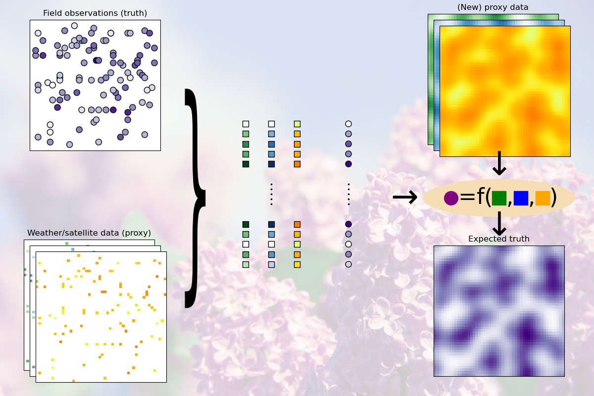

<!--
SPDX-FileCopyrightText: 2023 Springtime authors

SPDX-License-Identifier: Apache-2.0
-->

For detailed information and instruction, please refer to the
[documentation](https://springtime.readthedocs.io/)

<!--intro-start-->
# Springtime

The Springtime Python package helps to streamline workflows for doing machine
learning with phenological datasets.

Phenology is the scientific discipline in which we study the lifecycle of plants
and animals. A common objective is to develop (Machine Learning) models that can
explain or predict the occurrence of phenological events, such as the blooming
of plants. Since there is a variety of data sources and existing tools to
retrieve and analyse phenology data, it is easy to get lost and disorganized.

With Springtime, we aim to provide a more streamlined workflow for working with
a variety of datasets and (ML) models. You can run Springtime as a command line
tool in a terminal or use it as a Python library e.g. in a Jupyter notebook.

## Example task

Predict the day of first bloom of the common lilac given indirect observations
(e.g. satellite data) and/or other indicators (e.g. sunshine and temperature).

<!--intro-end-->

